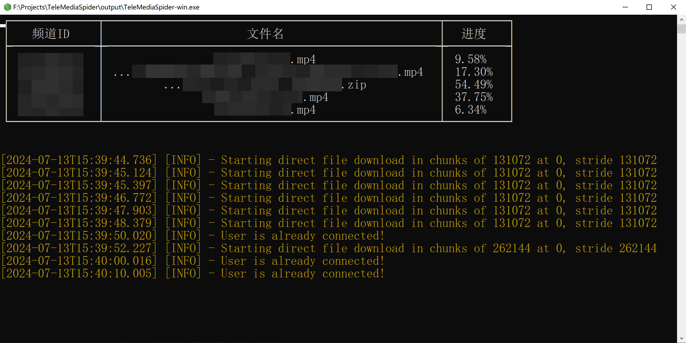

# TeleMediaSpider
Telegram 频道爬虫



# 初始化
```bash
yarn
```

# 如何调试
`VS Code` 中直接F5运行 `Launch`。

# 如何打包
`VS Code` 中运行 `pack executable` 任务，可执行文件会生成到 `output` 目录下。

<br />
<br />
<br />
<br />

# 如何使用

## 0. 下载
已打包好的TeleSpider可在这里下载：[https://github.com/liesauer/TeleMediaSpider/releases](https://github.com/liesauer/TeleMediaSpider/releases)，包含 `Windows x64` `Linux x64` 多个版本，如需其他版本，请自行打包。

## 1. 首次运行
第一次直接双击运行，会自动生成 `data/config.toml` 配置文件并提示让你配置，直接叉掉程序，并配置以下内容：
<br /><br />
`account.apiId`（参考文档，[Getting API ID and API HASH | GramJS](https://gram.js.org/getting-started/authorization#getting-api-id-and-api-hash)）
<br />
`account.apiHash`（参考文档，[Getting API ID and API HASH | GramJS](https://gram.js.org/getting-started/authorization#getting-api-id-and-api-hash)）
<br />
`account.account`（Telegram账号，**需要加上区号**，比如中国大陆就是：+861xxxxxxxxxx，其他区域同理）
<br />
~~`account.session`~~（这个不需要填）

## 2. 获取频道列表
```bash
TeleMediaSpider --list
```
完成账号配置后，使用终端运行上面的命令，第一次会要求你登录，填入收到的验证码就行，然后会列举出你账号加入的所有频道，复制频道ID，并打开 `data/config.toml` 配置文件，配置以下内容：
<br /><br />
`spider.channels`

配置好要抓取的频道id后，也是叉掉程序，再次双击打开，就可以开始抓取了。

**注意：这是获取正确的频道id的唯一方法，不可以使用机器人获取，机器人获取到的频道id无法使用。**

示例：

```toml
[spider]
channels = [ "频道id1", "频道id2" ]
```

如何抓取自己的已保存信息？
<br />
使用固定的频道id：`me` 即可，其他不变。

默认抓取频道的`图片` `视频` `音频` `文件`，如果你想特定的频道只抓取特定的数据，也可自由配置，有效值：`photo` `video` `audio` `file`。

将以下配置

```toml
  [spider.medias]
  _ = "photo,video,audio,file"
```

修改为

```toml
  [spider.medias]
  频道id1 = "photo"
  频道id2 = "photo,video,audio,file"
```

## 3. 正式抓取
直接运行 `TeleMediaSpider`，爬虫将会自动抓取频道信息，自动获取新消息，支持断点续爬，可任意时刻随意关闭软件。

## 4. 并发下载
**注意：这并不是传统意义上的并发下载，而是指多频道同时下载，单一频道只能一条一条信息从前往后解析下载。**

将以下配置

```toml
[spider]
concurrency = 5
```

修改为你想要的多频道同时下载数，默认为5个频道同时下载。

## 5. 大小过滤
默认抓取大小不超过10GB的文件，如有需求，可按全局配置或按频道配置文件大小过滤。

格式：`下限-上限`
<br />
单位：`字节`
<br />
进制：`1024`
<br />
示例：`102400-10485760`
<br />
解释：抓取文件大小在 `100KB ~ 10MB` 之间的文件（含）

优先级：`频道配置 > 全局配置`

### 5.1. 全局配置
修改以下配置即可

```toml
[filter.default]
photo = "0-10737418240"
video = "0-10737418240"
audio = "0-10737418240"
file = "0-10737418240"
```

### 5.2. 频道配置
修改以下配置即可

```toml
[filter.photo]
频道id1 = "102400-999999999"

[filter.video]
频道id1 = "102400-999999999"

[filter.audio]
频道id1 = "102400-999999999"

[filter.file]
频道id1 = "102400-999999999"
```

## 代理设置
参考：
<br />
[Using MTProxies and Socks5 Proxies](https://gram.js.org/getting-started/authorization#using-mtproxies-and-socks5-proxies)

# 配置说明

**配置文件中所有的 `_` 配置项都是占位，用来当成示例配置供参考填写的，删除无实际影响。**

# 数据保存
所有数据都保存在 `data/{频道id}[/{子组id}]` 文件夹下，文件名格式：`[{聚合id}_]{消息id}[_{原文件名}]`。
